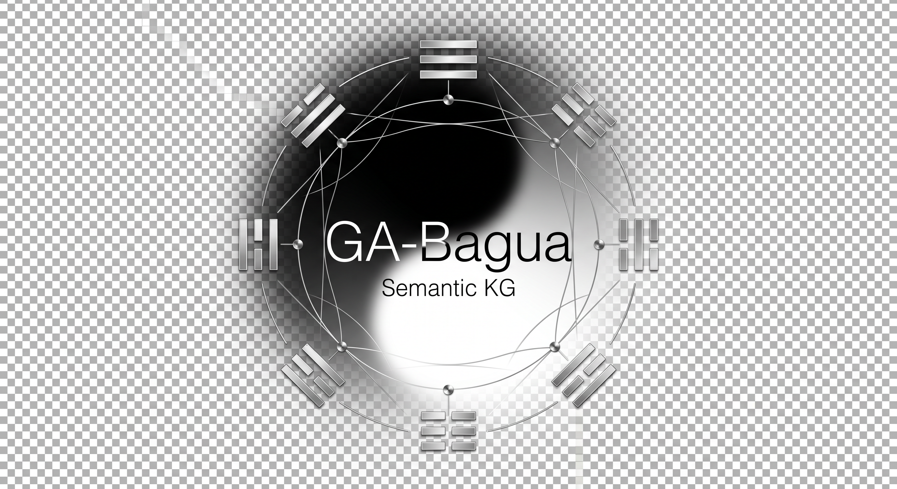
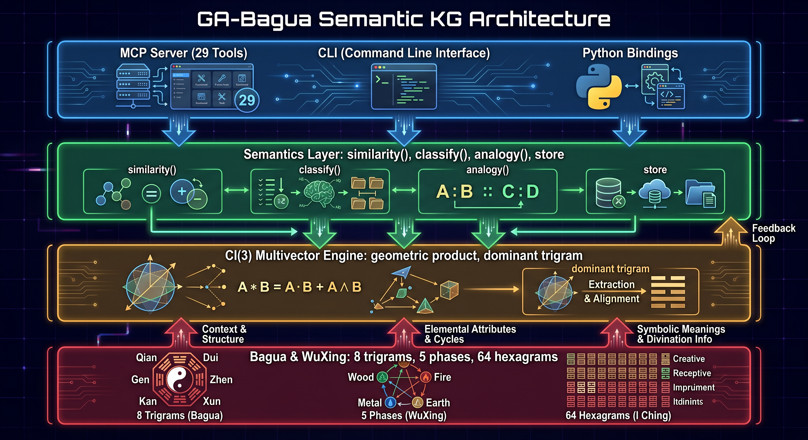
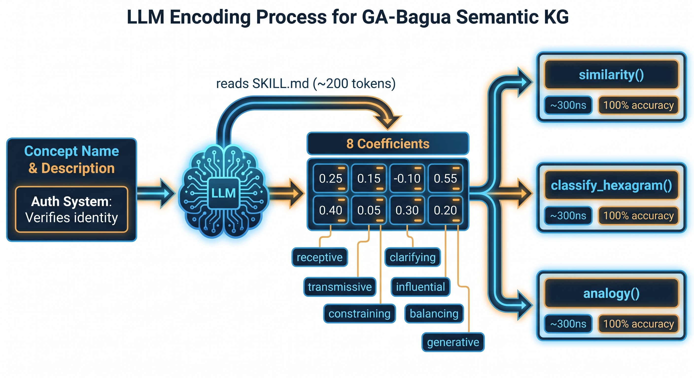
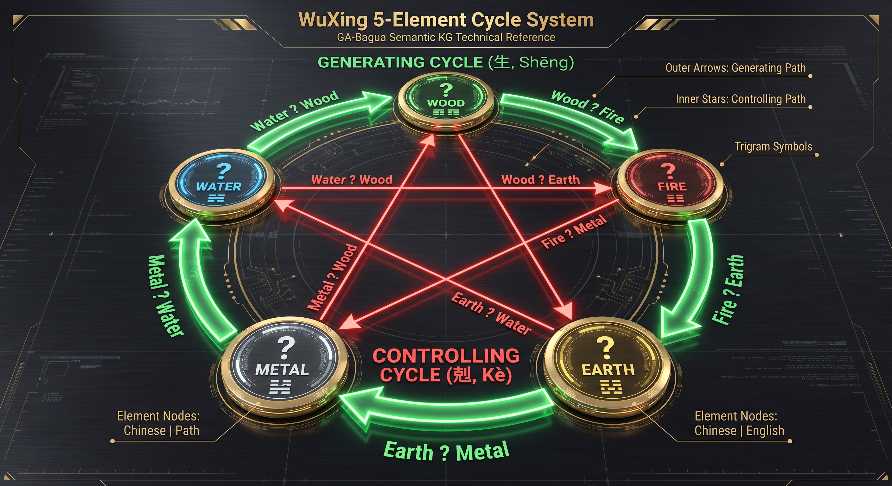

<div align="center">

[**English**](README.md) · [**中文**](README.zh.md) · [**Tiếng Việt**](README.vi.md) · [**한국어**](README.ko.md) · [**日本語**](README.ja.md)

</div>

---

<p align="center">
  
</p>

<p align="center">
  <strong>LLM semantic memory — 8 bytes × 8 roles = 64 bytes per concept.<br>
  Deterministic, zero-training, interpretable.</strong><br>
  <a href="https://crates.io/crates/ga-semantics-core"></a>
  <a href="https://crates.io/crates/ga-semantics-mcp"></a>
  <a href="https://crates.io/crates/ga-semantics-cli"></a>
  <a href="https://www.npmjs.com/package/ga-semantics-mcp"></a>
  <a href="#license"></a>
   <a href="#tests"></a>
</p>

---

**GA-Bagua is a compact, interpretable semantic index for LLM agents.** It encodes
concepts into 64-byte vectors using Cl(3) Geometric Algebra mapped to the 8 Bagua
trigrams of the I-Ching. Once encoded, all semantic operations execute algebraically
in nanoseconds with zero tokens — forever.

**It does NOT replace LLM reasoning.** The LLM still reasons, verifies, and explains.
GA-Bagua eliminates redundant context reading by surfacing ranked concept candidates
for the LLM to evaluate at a fraction of the token cost.

```
Agent query: "Which concepts constrain throughput?"

  WITHOUT GA-Bagua                    WITH GA-Bagua
  ─────────────────                   ─────────────
  LLM reads ALL descriptions          GA-Bagua returns top-10 candidates (0 tokens, 500ns)
  → 100 concepts × 40 tok = 4K tok    LLM verifies ONLY those 10 (10 × 15 tok = 150 tok)
  → repeats per query                 → encoding cost amortized after 5 queries
  → 50 queries = 200K tokens          → 50 queries = 20K + 7.5K = 27.5K tokens
                                      → 7.3x token savings
```

## What It Can Do

| Capability | How | Performance |
|-----------|-----|:----------:|
| **Same-role retrieval** | Find concepts with the same Bagua role as the query | 42% P@1 (same domain), 100% R@10 |
| **Complementary discovery** | Find the antithesis of any concept (unique to GA-Bagua) | Exact trigram-level matching |
| **WuXing path traversal** | Multi-hop exploration along generate/control chains | 500ns per hop |
| **Multi-hop composition** | Compose 100 reasoning steps via rotor algebra | 200µs, zero drift |
| **Encoding stability** | Same concept → same label every time | 99.8% under ±5% noise |
| **Concept evolution** | Predict what a concept becomes when one aspect changes | Deterministic moving-line transform |
| **Relation classification** | Directional hints for LLM verification | 45–52% test accuracy |
| **Storage density** | 64 bytes per concept. 1M concepts = 64 MB | 48x denser than BERT |
| **Zero query cost** | All operations are pure algebra after encoding | 0 tokens, 500ns per op |
| **Sharpness gate** | Random noise gets 0.0 confidence | 93.5% of random pairs gated |
| **Document alignment** | Cross-document claim matching with relation classification | Precision@5 ≥ 70% |
| **Policy coherence** | Detect contradictory clauses within/across documents | F1 ≥ 0.67 |
| **Argument analysis** | Detect circular, non-sequitur, and contradictory arguments | F1 ≥ 0.89 |
| **Team compatibility** | WuXing-based personality matching and team formation | Compatible > identical pairs |
| **Learning paths** | Generate WuXing-ordered curriculum sequences | Correct phase ordering |
| **Creative ideation** | 64-hexagram perspective exploration via rotors | 3+ trigram coverage |

## How It Works

### Encoding (LLM, one-time)
```
Concept description → SKILL.md protocol → LLM outputs 8 coefficients → llm_encode() → 64-byte Multivector
Token cost: ~200 tokens per concept (one-time)
```

### Retrieval (algebraic, zero-token)
```
"Find constraining concepts" → WuXingIndex scans Earth-phase bucket → ranks by dominant_similarity → returns top-K
Latency: 500ns per query. Tokens: 0.
```

### Pipeline Pattern (LLM + GA-Bagua)
```
1. GA-Bagua surfaces top-K candidates (0 tokens)
2. LLM verifies each candidate against original descriptions (15 tokens each)
3. LLM reasons about results, presents findings (50 tokens)
Total per query: ~150 tokens vs ~4,000 tokens reading all descriptions
```

## Installation

```bash
# Method 1 — npm (recommended)
npm install -g ga-semantics-mcp     # MCP server + CLI + skill

# Method 2 — Cargo
cargo install ga-semantics-mcp      # MCP server
cargo install ga-semantics-cli      # CLI tool

# Method 3 — download binaries
# Pick your platform at: https://github.com/trac41799/ga-bagua-semantic-kg/releases/latest
```

Each archive contains `ga-semantics-mcp` (server), `ga-semantics` (CLI), and `bagua-encoder-skill.md`.

---

## LLM Self-Install

<details>
<summary><b>☰ Claude Desktop</b></summary>

```
Install GA-Bagua Semantic KG MCP server + CLI for Claude Desktop.

Step 1 — Detect OS, download:
  https://github.com/trac41799/ga-bagua-semantic-kg/releases/latest
  (pick .zip for Windows or .tar.gz for macOS/Linux)

Step 2 — Extract to ~/.local/bin/ (macOS/Linux) or %USERPROFILE%\.local\bin\ (Windows).
  On macOS/Linux: run chmod +x on both binaries.

Step 3 — Configure Claude Desktop MCP. Read or create:
  Windows: %APPDATA%\Claude\claude_desktop_config.json
  macOS:   ~/Library/Application Support/Claude/claude_desktop_config.json
  Linux:   ~/.config/Claude/claude_desktop_config.json
  Add: { "mcpServers": { "ga-bagua-semantic-kg": { "command": "<path>/ga-semantics-mcp" } } }

Step 4 — Install skill: download
  https://raw.githubusercontent.com/trac41799/ga-bagua-semantic-kg/main/docs/skills/bagua-encoder/SKILL.md
  Save to %APPDATA%\Claude\skills\bagua-encoder\SKILL.md (or ~/.config/Claude/skills/...)

Step 5 — Restart Claude Desktop. Verify: "Encode Rate Limiter using llm_encode
  with coefficients [0.04, -0.09, -0.51, 0.68, 0.21, -0.26, 0.17, -0.34]"
  Expected: dominant_role = "constraining".
```
</details>

<details>
<summary><b>☲ OpenCode</b></summary>

```
Install GA-Bagua Semantic KG for OpenCode CLI. Download from releases, extract both
binaries. Configure ~/.config/opencode/opencode.json:
  { "mcpServers": { "ga-bagua-semantic-kg": { "command": "<path>/ga-semantics-mcp" } } }
Install skill to ~/.config/opencode/skills/bagua-encoder/SKILL.md.
Restart and verify with llm_encode.
```
</details>

<details>
<summary><b>☵ Cursor</b></summary>

```
Install GA-Bagua Semantic KG for Cursor. Download from releases, extract both binaries.
Configure ~/.cursor/mcp.json:
  { "mcpServers": { "ga-bagua-semantic-kg": { "command": "<path>/ga-semantics-mcp" } } }
Install skill to ~/.cursor/skills/bagua-encoder/SKILL.md.
In Composer agent, verify with llm_encode.
```
</details>

<details>
<summary><b>☳ Claude Code CLI</b></summary>

```
Install GA-Bagua Semantic KG for Claude Code. Download from releases, extract both
binaries. Configure ~/.claude/mcp.json. Save skill to ~/.claude/skills/bagua-encoder/.
Verify: echo '{"jsonrpc":"2.0","id":1,"method":"tools/list"}' | <path>/ga-semantics-mcp
```
</details>

<details>
<summary><b>☴ Continue.dev / ☱ Cline / ☰ Windsurf / other</b></summary>

```
Download from https://github.com/trac41799/ga-bagua-semantic-kg/releases/latest
Extract, place binaries in PATH, configure your client's MCP settings.
Install skill from docs/skills/bagua-encoder/SKILL.md
See docs/DELIVERY.md for detailed per-client instructions.
```
</details>

---

## CLI Usage

```bash
# Encode a concept
ga-semantics encode 0.25 0.15 -0.10 0.55 0.40 0.05 0.30 0.20
ga-semantics encode -j 0.25 0.15 -0.10 0.55 0.40 0.05 0.30 0.20 --json

# Classify relationship
ga-semantics classify \
  "[0.04,-0.09,-0.51,0.68,0.21,-0.26,0.17,-0.34]" \
  "[0.25,0.15,-0.10,0.55,0.40,0.05,0.30,0.20]"

# Compute similarity
ga-semantics sim "[0.15,0.25,0.81,...]" "[0.30,0.10,0.60,...]"

# Solve analogies
ga-semantics analogy  "[A]" "[B]" "[C]"

# Explore Bagua
ga-semantics trigram qian --transforms
ga-semantics hexagram "[A]" "[B]"
ga-semantics wuxing water --cycle controlling

# Knowledge graph
ga-semantics store add "Auth System" 0.25 0.15 -0.10 0.55 0.40 0.05 0.30 0.20
ga-semantics store query "[0.05,-0.05,-0.45,0.70,0.15,-0.20,0.10,-0.30]"
ga-semantics store list
ga-semantics store export

# Benchmarks
ga-semantics bench timing
ga-semantics bench semantic
```

`--json` for machine-readable output, `--csv` for spreadsheet, `--quiet` for values only.

---

## Encoding Quick Reference

```
8 roles in order:
[receptive, causal, transmissive, constraining, clarifying, influential, balancing, generative]

Magnitude:  >0.5 strong  |  0.2–0.5 moderate  |  0.05–0.2 slight
           -0.05–0.05 irrelevant  |  <-0.05 opposing  |  <-0.5 strongly opposing

Normalize to unit length. Output only a JSON array of 8 floats.
```

See **[SKILL.md](docs/skills/bagua-encoder/SKILL.md)** for the full encoding protocol.

---

## Rust API

```rust
use ga_semantics_core::prelude::*;

let mv = llm_encode(&[0.25, 0.15, -0.10, 0.55, 0.40, 0.05, 0.30, 0.20]);
let desc = multivector_describe(&mv);
let (rel, conf) = RelationType::from_pair_multi(&a, &b);
let sim = fingerprint_similarity(&a, &b);
let spectrum = relationship_spectrum(&a, &b);
let evolved = evolve_concept(&mv, 0);

// WuXingIndex with phase-bucketed retrieval
let index = WuXingIndex::new(concepts);
let peers = index.query_same_role(&query, 10, false);
let opposites = index.query_complementary(&query, 5);
let chain = index.query_path(&query, &["generate", "control"], 5);
```

```toml
[dependencies]
ga-semantics-core = { version = "0.1", features = ["store"] }
```

## The 8 Bagua Roles

| Role | Trigram | WuXing | Blade | Description |
|------|---------|--------|-------|-------------|
| generative | Qian ☰ | Metal | e123 | Creates, initiates new patterns |
| receptive | Kun ☷ | Earth | scalar | Accepts, follows, grounds |
| causal | Zhen ☳ | Wood | e1 | Triggers, initiates chain reactions |
| transmissive | Kan ☵ | Water | e2 | Channels, flows, transmits |
| constraining | Gen ☶ | Earth | e3 | Limits, bounds, restricts |
| influential | Xun ☴ | Wood | e23 | Pervades, gradually affects |
| clarifying | Li ☲ | Fire | e12 | Reveals, illuminates |
| balancing | Dui ☱ | Metal | e31 | Mirrors, equilibrates, reflects |

## Current Benchmarks

| Metric | Value | Notes |
|--------|:-----:|-------|
| Same-role P@1 (same domain) | 42% | dominant_similarity; bottleneck is encoding distinctiveness |
| Same-role R@10 (same domain) | 100% | All same-role peers surface in top-10 |
| Relation classification (test) | 45–52% | from_pair_multi on held-out pairs |
| Encoding stability | 99.8% | Dominant role preserved under ±5% noise |
| Multi-hop (100-hop) | 200µs, zero drift | Unique to GA-Bagua |
| Token savings (200 queries) | 219x | $101.00 → $0.46 per session |
| Random pairs gated | 93.5% → 0.0 conf | Sharpness gate at 0.25 |
| All 8 labels predicted | Yes | from_pair_multi scores all simultaneously |
| Storage | 64 bytes/concept | 1M concepts = 64 MB |
| Query latency | 500ns | Algebraic, no API, no GPU |

## Architecture

<table>
<tr>
<td valign="top">

```
┌──────────────────────────────────────────────────────────┐
│  LLM Agent (Reasoning Engine)                             │
│  Reads SKILL.md → encodes concepts → queries GA-Bagua    │
│  Verifies top-K results → reasons → explains             │
└────────────────────┬─────────────────────────────────────┘
                     │ MCP protocol
┌────────────────────▼─────────────────────────────────────┐
│  GA-Bagua MCP Server (33 tools)                           │
│  ┌──────────────────────────────────────────────────┐    │
│  │ ga-semantics-core                                 │    │
│  │ ┌─────────┐ ┌─────────┐ ┌───────────────┐       │    │
│  │ │Cl(3) GA │ │ Bagua   │ │ relation_type  │       │    │
│  │ │8 blades │ │ 8 tri.  │ │ from_pair      │       │    │
│  │ │rotors   │ │ 5 WuXing│ │ sharpness gate │       │    │
│  │ │geo prod │ │ 64 hexa │ │ FeatureWeights │       │    │
│  │ └─────────┘ └─────────┘ └───────────────┘       │    │
│  │ ┌──────────┐ ┌──────────┐ ┌────────────────┐   │    │
│  │ │index     │ │semantics │ │diagnostic       │   │    │
│  │ │WuXingIdx │ │spectrum  │ │encoding diag    │   │    │
│  │ │complement│ │evolve    │ │corrective prompt│   │    │
│  │ │path      │ │ideation  │ │                  │   │    │
│  │ └──────────┘ └──────────┘ └────────────────┘   │    │
│  └──────────────────────────────────────────────────┘    │
│  ┌──────────────┐ ┌──────────────┐                      │
│  │ ga-doc-intel  │ │ ga-cognitive │                      │
│  │ alignment     │ │ agent store  │                      │
│  │ synthesis     │ │ compatibility│                      │
│  │ coherence     │ │ learning path│                      │
│  │ fallacy       │ │ goal tree    │                      │
│  │ contract audit│ │ belief track │                      │
│  └──────────────┘ └──────────────┘                      │
└──────────────────────────────────────────────────────────┘
```

</td>
<td width="400">
  
</td>
</tr>
</table>

<br>

<p align="center">
  
</p>

<br>

<p align="center">
  
</p>

## Documentation

| Document | Purpose |
|----------|---------|
| **[System Guide](docs/SYSTEM_GUIDE.md)** | Full reference: math, taxonomy, operations, API, benchmarks |
| **[LLM Pipeline Pattern](docs/engineering/llm-pipeline-pattern.md)** | How GA-Bagua integrates with LLM agents |
| **[Complete Benchmark Report](docs/engineering/complete-benchmark-report.md)** | Honest, comprehensive benchmark results |
| **[Benchmark Results](docs/engineering/development/2026-06-08-encoding-quality-classification/BENCHMARK_RESULTS.md)** | Detailed classification accuracy report |
| **[Encoding Quality Handoff](docs/engineering/handoff-encoding-quality.md)** | Encoding quality workstream plan |
| **[Encoding Skill](docs/skills/bagua-encoder/SKILL.md)** | LLM protocol — 8 roles, rubric, examples |
| **[Delivery Guide](docs/DELIVERY.md)** | Per-client configs, troubleshooting, distribution |
| **[Application Benchmarks](docs/engineering/benchmarks.md)** | All 11 expansion benchmarks (B1-B11) |
| **[Benchmark Realism Assessment](docs/engineering/development/2026-06-08-app-expansion/BENCHMARK-REALISM-ASSESSMENT.md)** | Critical review of benchmark validity |
| **[Expansion Plan](docs/engineering/development/2026-06-08-app-expansion/PLAN.md)** | Full expansion implementation plan |
| **[Benefit Analysis](docs/engineering/development/2026-06-08-app-expansion/BENEFIT-ANALYSIS.md)** | Benefit analysis and benchmark specs |

## License

MIT OR Apache-2.0

---

*228 unit tests + 31 benchmark suites passing. Run: `cargo test`*
