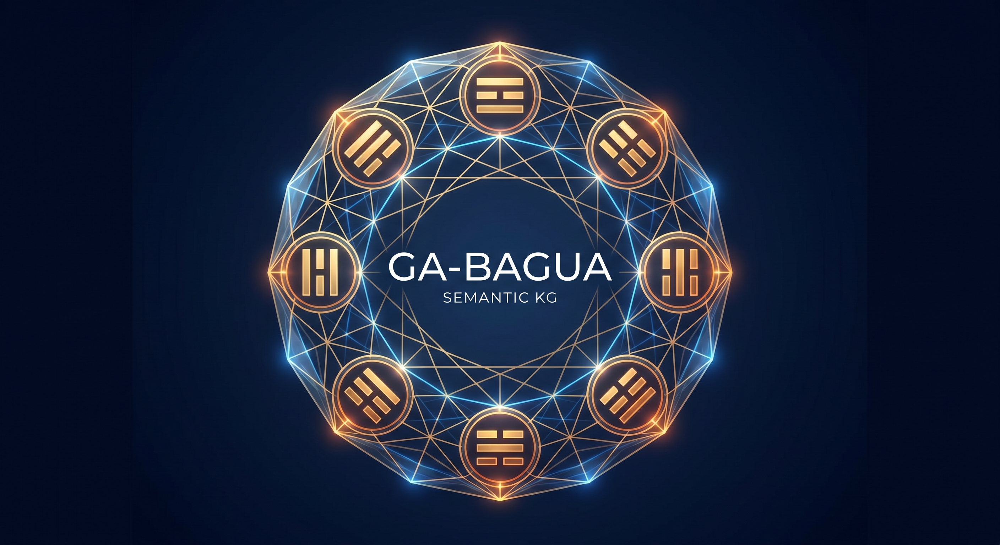

<div align="center">

[**English**](README.md) · [**中文**](README.zh.md) · [**Tiếng Việt**](README.vi.md) · [**한국어**](README.ko.md) · [**日本語**](README.ja.md)

</div>

---

<p align="center">
  
</p>

<p align="center">
  <strong>LLM 语义记忆 — 8 个维度，64 卦状态，零训练。</strong><br>
  <a href="https://crates.io/crates/ga-semantics-core"></a>
  <a href="https://crates.io/crates/ga-semantics-mcp"></a>
  <a href="https://crates.io/crates/ga-semantics-cli"></a>
  <a href="https://www.npmjs.com/package/ga-semantics-mcp"></a>
  <a href="#license"></a>
</p>

---

每个概念变成 **8 个数字**。每种关系是一个 **五行步**。无需训练。
无需向量数据库。无需重复调用 LLM。推理在 **34 纳秒** 到 **320 微秒** 内完成，
累积误差为零。

```
 概念名
      │
      ▼
 LLM（阅读 SKILL.md，约 200 tokens，一次性）
      │
      ▼
 [☷ 0.04, ☳ -0.09, ☵ -0.51, ☶ 0.68, ☲ 0.21, ☴ -0.26, ☱ 0.17, ☰ -0.34]
      │
      ├── 相似?    →  dominant_similarity()
      ├── 关系?    →  classify_hexagram()       （五行周期查找）
      └── 类比?    →  analogy()                  （周期方向预测）
```

| 木 生火 | 火 生土 | 土 生金 | 金 生水 | 水 生木 |
|:---:|:---:|:---:|:---:|:---:|
| 关系 100% | 角色 100% | P@K 73.3% | MRR 0.878 | 类比 80% |

---

## 安装

```bash
# 方式 1 — npm（推荐）
npm install -g ga-semantics-mcp     # MCP 服务器 + CLI + 技能文件

# 方式 2 — Cargo
cargo install ga-semantics-mcp      # MCP 服务器
cargo install ga-semantics-cli      # CLI 工具

# 方式 3 — 下载二进制文件
# 在以下地址选择您的平台：https://github.com/trac41799/ga-bagua-semantic-kg/releases/latest
```

每个压缩包包含 `ga-semantics-mcp`（服务器）、`ga-semantics`（CLI）和 `bagua-encoder-skill.md`（编码技能文件）。

---

## LLM 自助安装

<details>
<summary><b>☰ Claude Desktop</b></summary>

```
为 Claude Desktop 安装 GA-Bagua 语义知识图谱 MCP 服务器 + CLI。

步骤 1 — 检测我的操作系统，下载：
  https://github.com/trac41799/ga-bagua-semantic-kg/releases/latest
  （Windows 选 .zip，macOS/Linux 选 .tar.gz）

步骤 2 — 解压到 ~/.local/bin/（macOS/Linux）或 %USERPROFILE%\.local\bin\（Windows）。
  macOS/Linux 上执行：chmod +x 两个可执行文件。

步骤 3 — 配置 Claude Desktop MCP。读取或创建：
  Windows: %APPDATA%\Claude\claude_desktop_config.json
  macOS:   ~/Library/Application Support/Claude/claude_desktop_config.json
  Linux:   ~/.config/Claude/claude_desktop_config.json
  添加：{ "mcpServers": { "ga-bagua-semantic-kg": { "command": "<路径>/ga-semantics-mcp" } } }

步骤 4 — 安装技能文件：下载
  https://raw.githubusercontent.com/trac41799/ga-bagua-semantic-kg/main/docs/skills/bagua-encoder/SKILL.md
  保存到 %APPDATA%\Claude\skills\bagua-encoder\SKILL.md（或 ~/.config/Claude/skills/...）

步骤 5 — 重启 Claude Desktop。验证："编码 Rate Limiter，使用 llm_encode
  系数 [0.04, -0.09, -0.51, 0.68, 0.21, -0.26, 0.17, -0.34]"
  预期结果：dominant_role = "constraining"。
```
</details>

<details>
<summary><b>☲ OpenCode</b></summary>

```
为 OpenCode CLI 安装 GA-Bagua 语义知识图谱。从发布页面下载，解压两个
二进制文件。配置 ~/.config/opencode/opencode.json：
  { "mcpServers": { "ga-bagua-semantic-kg": { "command": "<路径>/ga-semantics-mcp" } } }
安装技能文件到 ~/.config/opencode/skills/bagua-encoder/SKILL.md。
重启后用 llm_encode 验证。
```
</details>

<details>
<summary><b>☵ Cursor</b></summary>

```
为 Cursor 安装 GA-Bagua 语义知识图谱。从发布页面下载，解压两个二进制文件。
配置 ~/.cursor/mcp.json：
  { "mcpServers": { "ga-bagua-semantic-kg": { "command": "<路径>/ga-semantics-mcp" } } }
安装技能文件到 ~/.cursor/skills/bagua-encoder/SKILL.md。
在 Composer 代理中使用 llm_encode 验证。
```
</details>

<details>
<summary><b>☳ Claude Code CLI</b></summary>

```
为 Claude Code 安装 GA-Bagua 语义知识图谱。从发布页面下载，解压两个
二进制文件。配置 ~/.claude/mcp.json。保存技能文件到 ~/.claude/skills/bagua-encoder/。
验证：echo '{"jsonrpc":"2.0","id":1,"method":"tools/list"}' | <路径>/ga-semantics-mcp
```
</details>

<details>
<summary><b>☴ Continue.dev / ☱ Cline / ☰ Windsurf / 其他</b></summary>

```
从 https://github.com/trac41799/ga-bagua-semantic-kg/releases/latest 下载
解压，将二进制文件加入 PATH，配置您客户端的 MCP 设置。
从 docs/skills/bagua-encoder/SKILL.md 安装技能文件
详细说明请参阅 docs/DELIVERY.md。
```
</details>

---

## CLI 使用

```bash
# 编码概念
ga-semantics encode 0.25 0.15 -0.10 0.55 0.40 0.05 0.30 0.20
ga-semantics encode -j 0.25 0.15 -0.10 0.55 0.40 0.05 0.30 0.20 --json

# 分类关系
ga-semantics classify \
  "[0.04,-0.09,-0.51,0.68,0.21,-0.26,0.17,-0.34]" \
  "[0.25,0.15,-0.10,0.55,0.40,0.05,0.30,0.20]"

# 计算相似度
ga-semantics sim "[0.15,0.25,0.81,...]" "[0.30,0.10,0.60,...]"

# 求解类比
ga-semantics analogy  "[A]" "[B]" "[C]"

# 探索八卦
ga-semantics trigram qian --transforms
ga-semantics hexagram "[A]" "[B]"
ga-semantics wuxing water --cycle controlling

# 知识图谱
ga-semantics store add "Auth System" 0.25 0.15 -0.10 0.55 0.40 0.05 0.30 0.20
ga-semantics store query "[0.05,-0.05,-0.45,0.70,0.15,-0.20,0.10,-0.30]"
ga-semantics store list
ga-semantics store export

# 基准测试
ga-semantics bench timing
ga-semantics bench semantic
```

`--json` 输出机器可读结果，`--csv` 输出表格格式，`--quiet` 只输出值。

---

## 编码速查表

```
8 个角色按顺序：
[接纳, 因果, 传递, 约束, 澄清, 渗透, 平衡, 创造]

量级：  >0.5 强  |  0.2–0.5 中等  |  0.05–0.2 轻微
       -0.05–0.05 无关  |  <-0.05 反向  |  <-0.5 强反向

归一化到单位长度。只输出一个 8 个浮点数的 JSON 数组。
```

完整编码协议请参阅 **[SKILL.md](docs/skills/bagua-encoder/SKILL.md)**。

---

## Rust API

```rust
use ga_semantics_core::prelude::*;

let mv = llm_encode(&[0.25, 0.15, -0.10, 0.55, 0.40, 0.05, 0.30, 0.20]);
let desc = multivector_describe(&mv);
let (rel, conf) = RelationType::from_pair(&a, &b);
let sim = dominant_similarity(&a, &b);
let d = analogy(&a, &b, &c);
```

```toml
[dependencies]
ga-semantics-core = { version = "0.1", features = ["store"] }
```

---

<table>
<tr>
<td valign="top">

## 架构

```
┌─────────────────────────────────────────┐
│  第 4 层 ── MCP + CLI + Python         │
│  第 3 层 ── 相似度、类比、存储          │
│  第 2 层 ── Cl(3) 多重向量引擎          │
│  第 1 层 ── llm_encode、角色描述         │
│  第 0 层 ── 八卦、五行、64 卦            │
└─────────────────────────────────────────┘
```

**8 个基面 × 8 种角色 × 5 个阶段 × 64 卦** — 一个完整的封闭形式
语义代数，通过五行的生成/克制周期进行确定性关系分类，
而非容易出错的代数变换。

</td>
<td width="400">
  
</td>
</tr>
</table>

<br>

<p align="center">
  
</p>

<br>

<p align="center">
  
</p>

---

## 文档

| 文档 | 说明 |
|----------|---------|
| **[系统指南](docs/SYSTEM_GUIDE.md)** | 完整参考：数学、分类法、操作、API、基准测试 |
| **[部署指南](docs/DELIVERY.md)** | 各客户端配置、故障排除、分发 |
| **[编码技能文件](docs/skills/bagua-encoder/SKILL.md)** | LLM 协议 — 8 种角色、评分标准、示例 |
| **[策略路线图](docs/engineering/strategy-to-excellence.md)** | 7 层改进路线图 |
| **[基准测试报告](docs/engineering/semantic-accuracy-benchmark.md)** | 真实的准确率报告 |

## 许可证

MIT OR Apache-2.0
